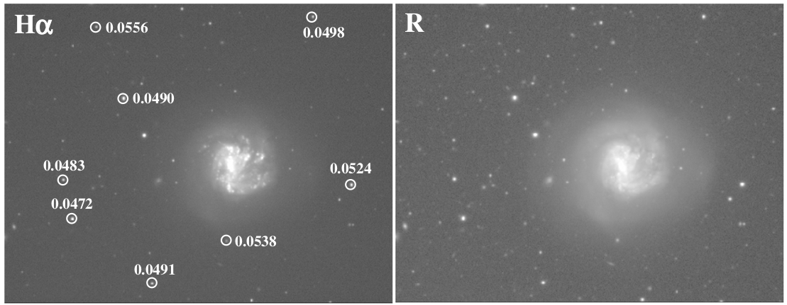
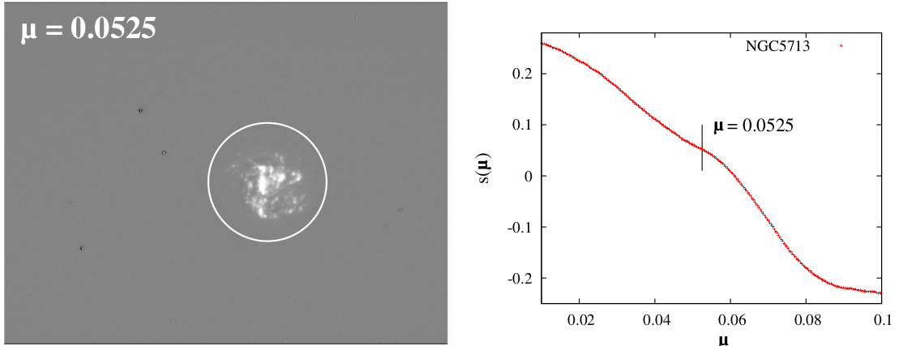

# Subtraction of Continuum Emission from Narrow-band Images
<br><br><br><br>

<style scoped>small { font-size: 0.4rem; line-height: 0.1rem; }</style>

<small style="font-size: 10px;">Hong, Sungryong, et al. “Quantitative Method for the Optimal Subtraction of Continuum Emission from Narrow-Band Images: Skewness Transition Analysis.” Publications of the Astronomical Society of the Pacific, vol. 126, no. 935, 2014, pp. 79–99. JSTOR, https://doi.org/10.1086/674666. Accessed 10 Dec. 2024.</small>

---

<!-- _class: lead -->
# First Steps...

---

## Proof of Concept
- One python/juptyer file.
- Show result image (NB image -  $\mu \bullet$ BB image) 
- Show result image for different $\mu$ scaling factors
- Each team member should try to code this example up

---

## Possible Ideas
Program should be able to:
- Superimpose stars from catalogue onto result image
- Mark all stars that have a mag larger than a set value
- Restrict the list of stars to within a given teh field of view
- Check if a given star vanished, check specific position
- Or list all stars that vanished (e.i. do not posses the emission line)
- Flexibility to choose catalogue (radio, etc..)
- Query a catalogue to find calibration sources (what is calibration source?)
<!-- - Calibration sources could be stars with periodicity < 2 -->
<!-- - hipparcos catalogue: for each star have ra, dec, periodicity, magnitude -->
- Show contours from BB image projected on (NB-μBB) image or vice versa?

---

## Questions
- What is "Quality Criteria"
- In what way do we show contours in the images?
- How to/Should we calculate the fluxes?
- Selecting subset of difference image (NB-μBB) where stars dominate over nebulae for best accuracy, how??
  - <small>Make option for user to define this region/subset</small>
  - <small>Determine an objective method to find such subsets?</small>
    - <small><small>Use stars catalogue + nebulae catalogue to find subset with stars dominating over nebulae via some algorithm?</small></small>

---

## Project Management
Hello

---

## Codebase specifics
```python
import astrosceni

sceni = new astrosceni.sceni

sceni.NB('path/to/NB/image.fits')
sceni.BB('path/to/BB/image.fits')

sceni.setScaleFactorRange([0, 2])

# Find the scale factor
factor = sceni.findOptimalScaleFactor()

# find image difference
imageDiff = sceni.getImageDifference(scaleFactor=factor)

# automatically uses optimal factor if none specified
imageDiff = sceni.getImageDifference()

# Plot or save the image difference
imageDiff.plot()
imageDiff.save('path/to/save/image.fits')
```
