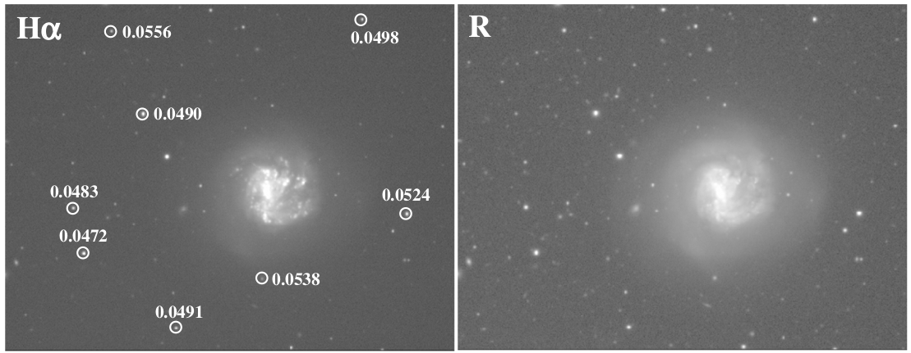
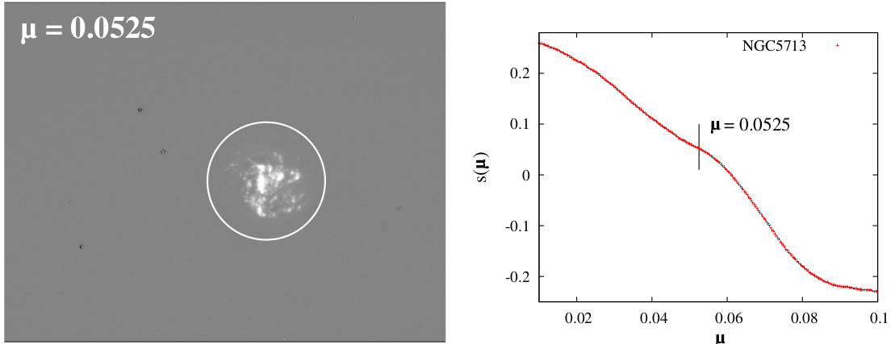

# Subtraction of Continuum Emission from Narrow-band Images
<br><br><br><br>

<style scoped>small { font-size: 0.4rem; line-height: 0.1rem; }</style>

<small style="font-size: 10px;">Hong, Sungryong, et al. “Quantitative Method for the Optimal Subtraction of Continuum Emission from Narrow-Band Images: Skewness Transition Analysis.” Publications of the Astronomical Society of the Pacific, vol. 126, no. 935, 2014, pp. 79–99. JSTOR, https://doi.org/10.1086/674666. Accessed 10 Dec. 2024.</small>

---

<!-- _class: lead -->
# First Steps...

---

<!-- _class: lead -->
# Summarize paper

---

## Skewness
As $\mu$ increases, $NB - \mu \bullet BB$ transtion from undersubtracted to over subtracted
<br>

## skewness = $\frac{1}{N-1} \sum^N_{i=1} \left( \frac{x_i - m}{\sigma} \right)^3$

- Check animation

---

## One dimentional simulation

$I_{NB}(x) = E(x) + \sum S_i(x) + B_{NB} + Noise[\sigma_{NB}(x)]$

$I_{BB}(x) = \sum S_i'(x) + B_{BB} + Noise[\sigma_{BB}(x)]$

1. Extended line-emission $E(x)$
2. Emission from stars $\sum S_i(x)$
3. Background $B$
4. Combined noise of all kinds $σ(x)$

---


<!-- _class: lead -->
# Simulate NB & BB images and use POC to analyze results


---

## Proof of Concept
- One python/juptyer file.
- Show result image (NB image -  $\mu \bullet$ BB image) 
- Show result image for different $\mu$ scaling factors
- Each team member should try to code this example up

---

## Possible Ideas
<!-- Program should be able to: -->
https://prod.liveshare.vsengsaas.visualstudio.com/join?C9F2E1A8DCBFBAABC0BBAEDA7DB8682A85E4
- Superimpose stars from catalogue onto result image
- Mark all stars that have a mag larger than a set value
- Restrict the list of stars to within a given teh field of view
- Check if a given star vanished, check specific position
- Or list all stars that vanished (e.i. do not posses the emission line)
- Flexibility to choose catalogue (radio, etc..)
- Query a catalogue to find calibration sources (what is calibration source?)
- Show contours from BB image projected on (NB-μBB) image or vice versa?
<!-- - Calibration sources could be stars with periodicity < 2 -->
<!-- - hipparcos catalogue: for each star have ra, dec, periodicity, magnitude -->
use symlognorm possibly to display data


---

<style scoped>section {font-size: 20px;}</style>

## What should program do? (in order)
- Find optimal $\mu$
  - User provides BB & NB images, and scale factor range (e.g. $\mu \in [0, 2]$)
  - User defines initial crop bounds in either pixels or (ra,dec) to remove unwanted/bad data from image before processing
  - User provides test region that will be used to calculate optimal $\mu$
  - Crop NB & BB data to the test region
  - Compute $NB-\mu \bullet BB$ for the range given in the test region
  - Calculate skewness of image for $\mu$ range
  - Find $\mu$ with skewness value closest to zero
- Remove stars
  - Get list of stars within the region of the full NB & BB images
  - Determine which stars can be seen (and thus need to be removed) (how?)
  - Remove the stars from NB & BB images (how?)
- Show final image
  - Subtract the edited NB & BB images using the optimal $\mu$
  - Show catalogue stars present in this region superimposed with user-filters
  - Have a feature to highlight catalogue stars that are not visible anymore (is this really necessary)
  - Display image (how? -> half pixels will be negative so need to think of how to plot) 


---

## Possible Classes
```python
class StarsFilter
  setCatalogue("name" or "http://link")
  getStarsInRegion(ra_1, ra_2, dec_1, dec_2, 
                  min_mag, max_mag, 
                  min_periodicity, max_periodicity)
```
```python
class StarsRemover
  setImage(image_header, imager_data)
  getStarsInImage()
  subtractStarsFromImage()
  getResultImage() # Decide if we need this later?
```
---

## Questions
- What is "Quality Criteria" -> Cnosider Skewness, or pixels arround a star in result image (is it normal dist) to check if star completely vanished or not
- In what way do we show contours in the images?
- How to/Should we calculate the fluxes?
- Selecting subset of difference image (NB-μBB) where stars dominate over nebulae for best accuracy, how??
  - <small>Make option for user to define this region/subset</small>
  - <small>Determine an objective method to find such subsets?</small>
    - <small><small>Use stars catalogue + nebulae catalogue to find subset with stars dominating over nebulae via some algorithm?</small></small>

---

## Project Management
Hello

---

<!-- _class: lead -->
## Codebase specifics

---

```python
from astrosceni import Image, Subtractor

NB = Image()
NB.load('path/to/NB/image.fits')
NB.crop(xStart, xStop, yStart, yStop) # Pass in coordinates to keep

BB = Image()
BB.load('path/to/BB/image.fits')
BB.crop(xStart, xStop, yStart, yStop) # Pass in coordinates to keep

# NB.crop and BB.crop is only to do prior cleaning before any operations

sub = Subtractor()

sub.seNBImage(NB)
sub.setBBImage(NB)

sub.setScaleFactorRange([0, 2])
sub.setTestRegion(
  coordinateSystem=([ra_1, dec_1], [ra_2, dec_2]), 
  # pixelSystem=([x_start, y_start], [x_end, y_end])
)

sub.calcOptimalScaleFactor()

sub.plotPixelDist(mu=0.1) 
# The above plots a histogram of the pixel distribution of a specific scale factor
sub.plotSkewVsMu()
# also overlay the optimal scale factor on the plot and print out its value

sub.getResultImage()
```

---

```python
from astrosceni import StarsFilter

filter = StarsFilter()

#Utilise a specific catalogue (can be defined by user)
filter.setCatalogue("hipparcos")

filter.setRegion(ra_1, ra_2, dec_1, dec_2)

filter.setMagLimit(min=9, max=1)   # Optional
filter.setPeriodicityLimit(min=0, max=2)   # Optional

# filter.getStarsInRegion(ra_1, ra_2, dec_1, dec_2, 
#                   min_mag=9, max_mag=1, 
#                   min_periodicity=0, max_periodicity=2)

filter.setVisibleStars(NB)
# a function to compare how visible a star is compared to the background
# get data from an image object, loop over all the stars to compare
# decide criteria for visible stars empirically by looking at plots

filter.getVisibleStars() # Returns all stars that can be seen in image
```

---

```python
from astrosceni import StarsRemover

remover = StarsRemover()

remover.setRemovableStars(filter.getVisibleStars())
remover.setTargetImage(NB)

remover.removeStars()
# image with stars removed stored here

remover.getResultImage()
# return image with stars removed 
```

---

```python
NB_remover.getResultImage()
BB_remover.getResultImage()

final_img = sub.getSubtractedImage(NB_remover.getResultImage(), BB_remover.getResultImage(), optimal_mu)
# subtract NB and BB using optimal mu and return result image

final_img.setLabeledStars(filter.getVisibleStars())
# Default always show stars labelled
```

---

```python
img1, img2 = ImageResizer.overlap(img1, img2)
```

---

```python
from astrosceni import Contour
cont = Contour()
cont.useImage(NB)
# pass image
cont.plot()
# plot contour only

NB.applyContour(cont) # apply contour to image class
NB.plot()
# plot image with contour superimposed
```

---

```python
class Subtractor:
  def __init__(self):
    self.NB_image.image_data
    self.BB_image
```

---

## Things to consider still

If NB and BB images have different sizes or different RA, DEC limits, what to do??
Should it be the responsibility of the user to properly crop using the Image.crop() function at the start?

What if the user has 2 images that partially overlap and user doesn't really wanna put effort into crunching the numbers to do a proper crop? Should there be a function that takes in two images and just returns the two images cropped into the dimensions where they both overalp?

---

### Classes

<style scoped>section { font-size: 1.37rem; }</style>

- Image class
  - load
  - cropPixels
  - cropCoords
  - setLabeledStars
  - plot
- Subtractor class
  - setNBImage
  - setBBImage
  - setScaleFactorRange
  - setTestRegion (Optional)
  - calcOptimalScaleFactor
  - plotPixelDist
  - plotSkewVsMu
  - getResultImage
  - getSutractedImage

---

<style scoped>section { font-size: 1.37rem; }</style>

- StarsFilter
  - setCatalogue (Optional)
  - setRegion
  - setMagLimit (Optional)
  - setPeriodicityLimit (Optional)
  - setVisibleStars
  - getVisibleStars
- StarsRemover
  - setRemovableStars
  - setTargetImage
  - removeStars
  - getResultImage
- ImageResizer
  - overlap (static)
- Contour
  - useImage
  - plot

---

- Josh
  - Subtractor class
  - StarsRemover
- Leo
  - StarsFilter
  - Contour
- Youssef
  - Image
  - ImageResizer